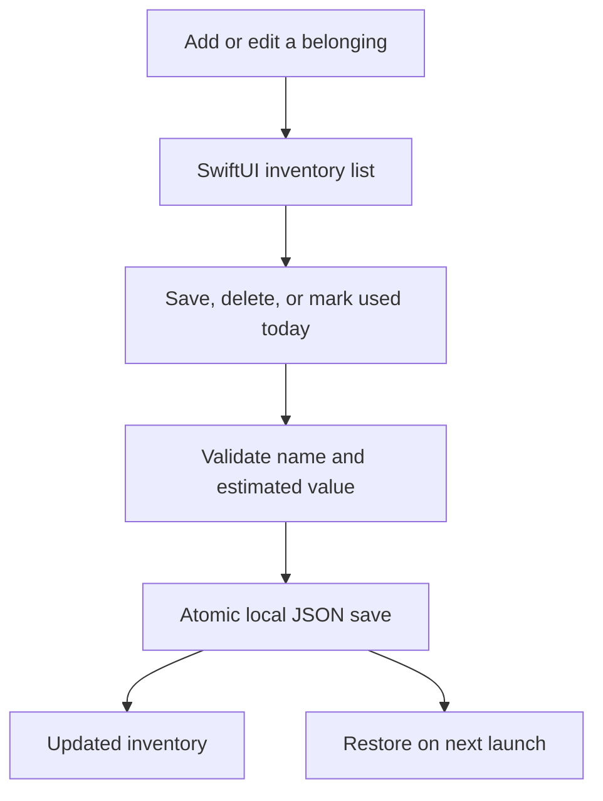

# Storage Tracker

A small macOS inventory app for keeping track of stored belongings: what an item is, where it lives, its estimated value, and when it was last used. Add and edit items, mark them used today, or remove them from your inventory. Changes save locally on your Mac.



## Try it

Requires macOS 13 or later and a Swift 5.9-compatible developer toolchain. The package has no external dependencies, accounts, API keys, or network integrations.

```sh
swift run StorageTracker
```

Choose **Add item**, enter a name and any optional details, then save. **Edit** changes an existing item; **Used today** resets its last-used date; the trash button asks before deleting it. Estimated values use USD and a decimal point, matching the original view's dollar-based design. The app starts empty; no real inventory or example belongings are loaded automatically.

Data is stored in `~/Library/Application Support/StorageTracker/inventory.json`. Writes are atomic, and the displayed inventory changes only after a successful save. If the file cannot be read, editing is disabled and the existing file is left untouched. Quit the app before manually repairing or restoring that file. This is a single-user local prototype; cloud sync and concurrent editing from separate app processes are not supported.

## How it is built

- **SwiftUI:** inventory list, item editor, empty state, deletion confirmation, and save errors.
- **InventoryCore:** item validation and a small Codable JSON store, using Foundation only.
- **Focused tests:** CRUD persistence across reloads, invalid inputs, corrupted/duplicate records, and failed-write behavior.

```sh
swift run InventoryChecks
```

See the [source map and validation record](docs/SOURCE_MAP.md).

## Project evolution

The original idea combined an inventory list with a camera-to-inventory workflow. The first published snapshot preserved the existing SwiftUI and Core Data scaffolding. A new implementation added during portfolio development on 2026-10-07 connects the manual inventory flow and replaces the unassembled persistence setup with local JSON storage. It is new work, not a claim that the original scaffold already ran.

Video capture and automatic item extraction remain future ideas; neither is implemented here. The previous source snapshot remains in Git history. No footage, household inventory, tutorial notebook, or credentials are included. Original project by Ved Sarkar, with the new implementation and documentation prepared with AI assistance; see [attribution](ATTRIBUTION.md).
