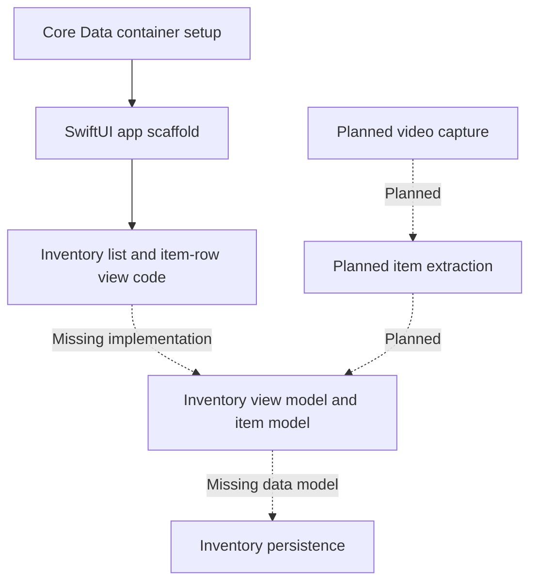

# Storage Tracker

A SwiftUI inventory concept for keeping track of stored belongings: what an item is, where it lives, its estimated value, and when it was last used. The source sketches an inventory list with deletion and date-reset actions, alongside a proposed camera-to-inventory workflow.

Solid arrows connect the included scaffolding. Dashed arrows represent missing or planned components; this diagram is not evidence of a working capture or inference pipeline.

## Included work

- An inventory view with item name, optional description/location, estimated value, and relative last-used date.
- View callbacks for deletion, resetting the last-used date, and a camera sheet.
- Loading/error presentation scaffolding and Core Data container initialization.
- Swift package configuration and two alternative app entry-point sketches.

## Source map and status

This is a source prototype, not an assembled runnable app. `InventoryViewModel`, `InventoryItem`, `CameraView`, and the Core Data model are referenced but absent. The package includes duplicate app entry points and does not include the separate inventory view in its target. A fuller implementation was not found in the local copies reviewed.

See the [source map](docs/SOURCE_MAP.md) for the exact included files and assembly gaps. No camera footage, household inventory, tutorial notebook, credentials, or inference integration is included. The source uses SwiftUI and Core Data; the package declares SwiftLog, though the supplied source does not use it.

No build, dependency installation, or runtime tests were performed for this packaging pass. Original code by Ved Sarkar; see [attribution and license status](ATTRIBUTION.md).
