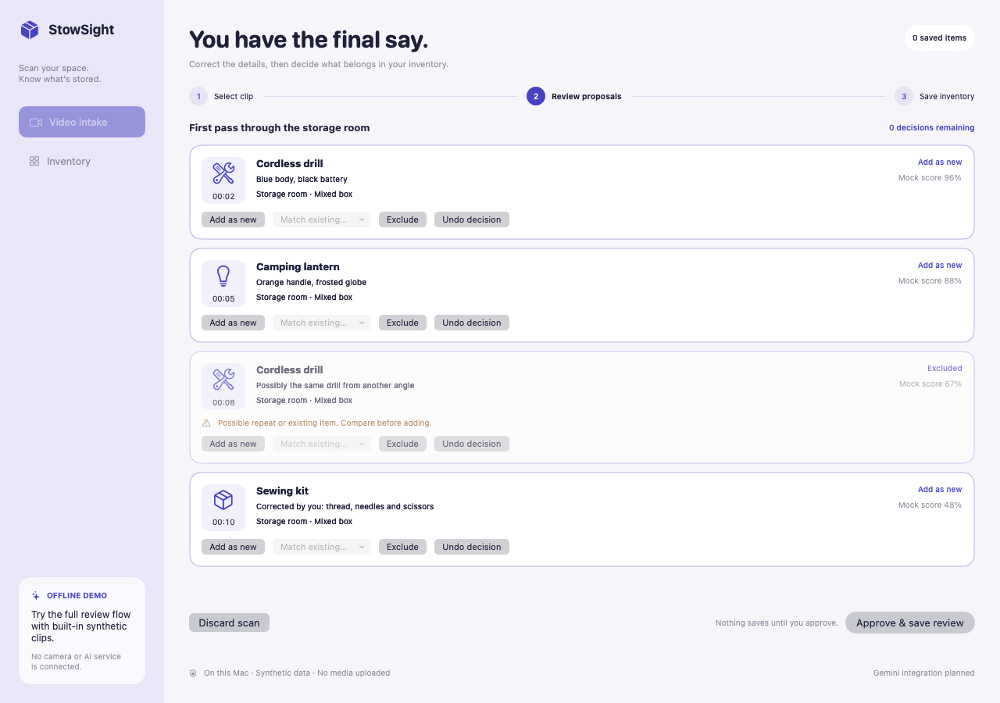
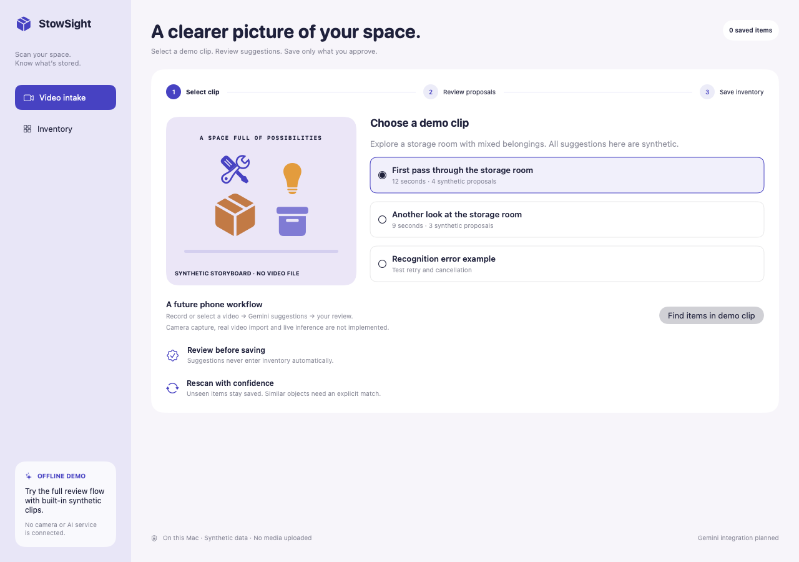
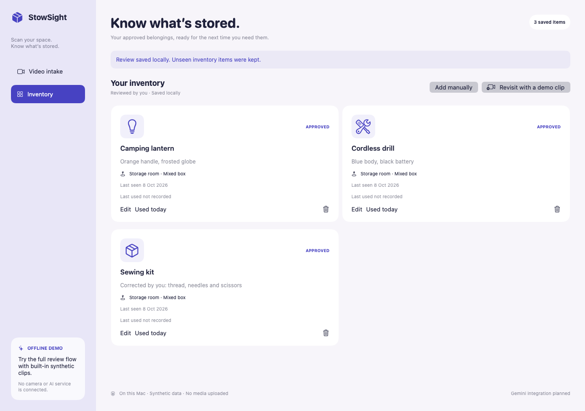
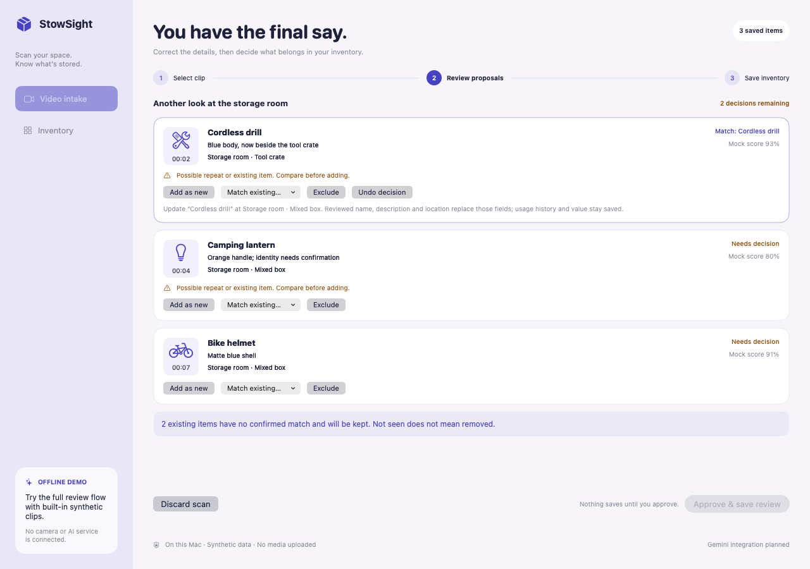

# StowSight

**Scan your space. Know what’s stored.**

Storage rooms, moving boxes, garages, and the things you haven’t organized yet. StowSight explores a simple idea: turn a video of your belongings into a useful catalogue, with you deciding what gets saved.

## Why I built this

My sister in December 2023, when video capable llms like gemini came out, had a storage unit below her studio apartment, and things stored there were easy to forget or lose track of. That got me thinking about StowSight: taking a quick video to create an inventory you could edit, with enough visual context to find the right box or drawer. The idea later expanded to moving, with inventories you could compare before and after.

> **Offline demo:** the macOS app uses a mock recognizer and synthetic observations. Review, local saving and rescans work today; phone video intake, visual item context and live Gemini recognition are planned.



*Suggestions are a starting point. Every item needs your decision before it enters inventory.*

## From a quick look to a useful catalogue

1. **Choose a clip.** In this demo, select a built-in synthetic storage-room scenario.
2. **Review what was found.** Edit names, descriptions and locations. Exclude a false positive or a repeated observation.
3. **Approve your inventory.** Save the reviewed batch locally, then find and edit your belongings later.
4. **Revisit the space.** Match a new observation to an existing item or approve it as a separate object. Items outside the new clip stay saved.

| Start with a space | Leave with a catalogue |
| --- | --- |
|  |  |

## A second video should add clarity

Every rescan gives you a chance to review what changed. Confirm a match to update a saved item, or approve a separate object to add it. Similar names are flagged for comparison, and belongings outside the clip stay in your inventory.



*The sewing kit is outside this scan. It remains in the inventory. The drill moves only after its match and corrected location are approved.*

[See the saved rescan](docs/screenshots/06-rescan-saved.png) · [Browse all six demo screens](docs/DEMO.md)

## Try it on your Mac

Requires **macOS 13+** and an installed **Swift 5.9+** developer toolchain. No extra packages, accounts, API keys or downloads are needed after obtaining the source.

From this source folder or the extracted demo package:

```sh
./Scripts/demo.sh
```

The repository URL remains `Storage-Tracker`; the product is **StowSight**. The launcher stores approved items in `.demo-data/inventory.json` inside your checkout. It leaves the earlier manual app’s inventory untouched.

For a direct launch, use `swift run StowSight`. The legacy `swift run StorageTracker` command still works. Direct launches retain the offline prototype’s `~/Library/Application Support/StorageTrackerDemo/inventory.json` location; `--data /absolute/path/inventory.json` selects another store. Avoid running two copies against the same file.

### Two-minute demo

- Choose **First pass through the storage room**, then **Find items in demo clip**.
- Rename **Small case** to **Sewing kit**. Exclude the second drill observation. Add the first drill, lantern and sewing kit, then choose **Approve & save review**.
- Choose **Revisit with a demo clip** and start **Another look at the storage room**. Match the drill and lantern to their saved items; add the helmet. The unseen sewing kit stays saved.
- Try the **Recognition error example** to exercise retry/cancel. **Discard scan** leaves saved inventory unchanged.

Manual add/edit, marking an item used, and confirmed deletion are also available. Scanning records **last seen**; you can record **last used** separately.

## What is implemented

| Implemented in this demo | Planned live integration |
| --- | --- |
| Synthetic clip selection and cancellable mock recognition | Phone camera and real video selection/preview |
| Editable proposals with add, match, exclude and undo decisions | Gemini recognition with timestamp/frame evidence |
| Explicit duplicate and rescan conflict handling | Candidate matching informed by visual evidence |
| Atomic local JSON saves and reload persistence | An authenticated backend and provider cleanup |
| Retry/error states and corrupt-store protection | Permission, privacy, budget and device validation |

The demo uses fictional scores, timestamps and imagery. Approved inventory persists locally; review drafts last for the current session. See the [validation record](docs/VALIDATION.md) for implementation limits.

## Build, check, reproduce

```sh
./Scripts/check.sh
./Scripts/screenshots.sh
```

The checks cover CRUD persistence, corrections and exclusions, duplicate ambiguity, rescan retention, stale reviews, cancellation and late responses, corrupt data, failed writes and successful retries. Screenshots are rendered from the actual SwiftUI/AppKit views with isolated synthetic data; no desktop recording is used.

[Validation evidence](docs/VALIDATION.md) · [Source map](docs/SOURCE_MAP.md) · [Live-integration plan](docs/LIVE_INTEGRATION.md)

## Project history

StowSight continues Ved Sarkar’s **Storage Tracker** concept. The first snapshot preserved the original SwiftUI/Core Data scaffolding. The 2026-10-07 implementation made manual inventory and JSON persistence work. The 2026-10-08 prototype adds the review-and-rescan workflow and StowSight branding, with AI assistance.

Earlier source remains in repository history. The original licensing and attribution notices remain in [ATTRIBUTION.md](ATTRIBUTION.md); [historical validation](docs/HISTORY.md) records the manual prototype’s scope.
