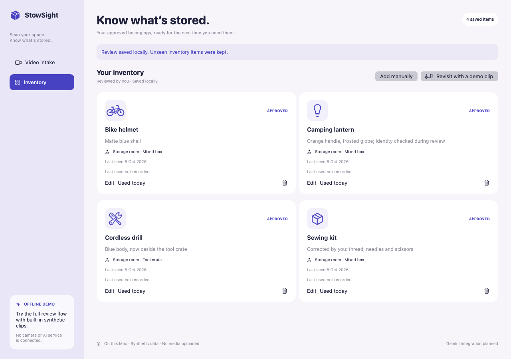
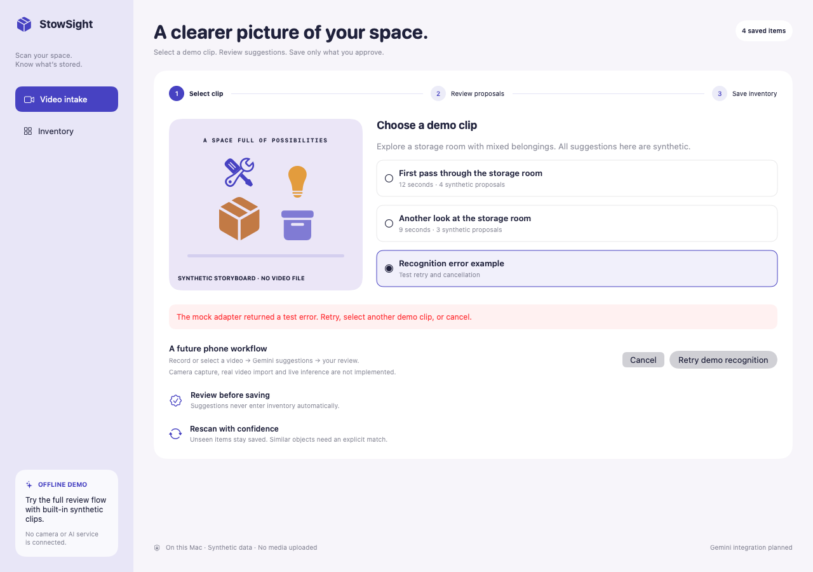

# StowSight demo gallery

These six screens are native renders of the working macOS SwiftUI prototype. Everything shown is synthetic. No video file, real household inventory, live model response or desktop recording was used.

## 1. Choose a storage-room scenario

The built-in clip choices feed fixed observations through the mock adapter. The UI states clearly that phone capture and live inference are future work.

## 2. Correct and approve

The ambiguous case becomes a sewing kit, and a repeated view of the drill is excluded. Names, descriptions and locations are editable. Approval remains an explicit action.

## 3. Return to saved belongings

Approved objects are stored in local JSON and survive relaunch. The app keeps last-seen and last-used history separate.

## 4. Reconcile a new observation

The drill is explicitly matched to an existing identity. The lantern and helmet still need decisions. Existing objects without a confirmed match will be kept.

## 5. Keep what the clip did not show

After approval, the inventory contains a new helmet, the drill’s reviewed location and the sewing kit that was outside the second scan.

## 6. Recover without losing inventory

A deliberate mock error exposes retry and cancel. Recognition failures do not mutate saved items.

## Reproduce the images

Run `./Scripts/screenshots.sh` from the repository root. The capture runner creates an isolated temporary JSON store, drives the real review model, and renders `ContentView` through `NSHostingView.cacheDisplay` at 1280 × 900. Temporary data is removed afterward. It requests no screen-recording permission and does not capture any other application.
